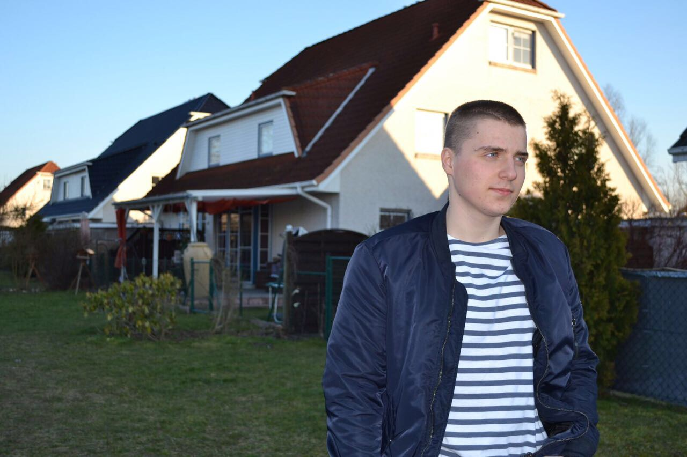

Hi, ich bin Domenic, iOS Developer. Ich liebe alles was mit Softwareentwicklung zu tun hat.

## Kompetenzen
- Design und Implementierung von Libraries und nativen iOS Apps
- Wartung und Refactoring bestehender Anwendungen
- Lieferung von hochwertigen und modernen Produkten
- Toolset: Swift, Objective-C, REST, Unit Tests, Core Data, Auto Layout, Jenkins, Fastlane, CocoaPods & more.

## Kontakt
Wenn du Probleme, Fragen oder Anregungen hast, schicke mir eine Email.

E-Mail: info@d-moran.de

Für weitere Informationen, schaue gerne bei meinem LinkedIn Profil vorbei.